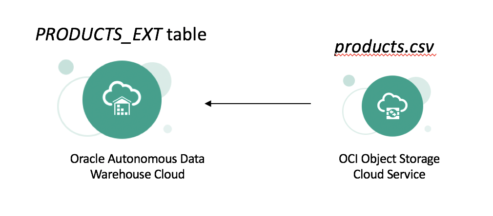
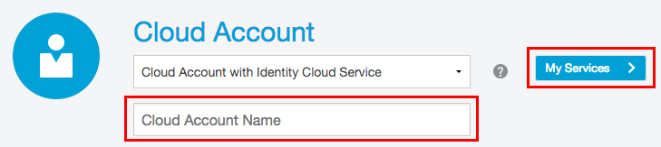

* Introduction to the use case of the entire workshop
* Acquire an Oracle Cloud Account
* Learn how to sign-in to the Oracle Public Cloud
* Learn how to provision a new ADWC database
* Learn how to download the client credentials wallet file
* Learn how to connect to ADWC from Oracle SQL Developer

# Introduction - Start Here

## Use case Overview
******* Please change the content/text everywhere ******** The goal of these usecases is to consolidate different kinds of data - relational and big data, in this demo - in one place such as [Oracle Autonomous Data Warehouse Cloud](https://cloud.oracle.com/en_US/datawarehouse). Here is the overall architecture of this demo. Don't be overwhelmed, we will explain more in detail in the coming sections.

Once we have the relational data and the big data in Oracle Autonomous Data Warehouse, we can connect it to Oracle Data Visualization Desktop for preparing reports and visualizations or we can perform data mining and machine learning in the Zeppelin notebooks that come out-of-the-box with Oracle Autonomous Data Warehouse Cloud service. The reports are shareable across the organization and a Data Analyst can run analysis similar to how he or she does on a regular database.

1. Usecase #1: Relational data to Oracle Autonomous Data Warehouse Cloud using Oracle Data Integration Platform Cloud

    This usecase explains how we can achieve loading data from a relational database, that could represent on-premise legacy data sources for an organization, into an Oracle Autonomous Data Warehouse Cloud instance. This is implemented using Oracle Data Integrator that is part of Oracle Data Integration Platform Cloud.

2. Usecase #2: Big data to Oracle Autonomous Data Warehouse Cloud using Oracle Data Lake (Oracle Big Data Cloud + Oracle Cloud Infrastructure Object Storage)

    This usecase shows how we can leverage Oracle Data Lake to run Big Data workloads and push it to Oracle Autonomous Data Warehouse Cloud after data processing.

3. Usecase #3: External Table

    In this usecase, we create an external table in Oracle Autonomous Data Warehouse Cloud from Oracle Cloud Infrastructure Object Storage. The data is not brought into Oracle Autonomous Data Warehouse Cloud, but resides in Oracle Cloud Infrastructure Object Storage and on which we can run queries efficiently.

4. Usecase #4: Visualization using Oracle Data Visualization Desktop

    In this last usecase, we show how we can connect Oracle Data Visualization Desktop and Oracle Autonomous Data Warehouse Cloud to make visualizations on the consolidated data and to obtain better data inisghts.

## Acquire an Oracle Public Cloud Account
You can choose one of the two options available below.
1. [$300 Trial Account Signup](https://millerhoo.github.io/journey2-new-data-lake/workshops/journey2-new-data-lake/?page=xtra300Trial.md)
2. [Employee GSE Account Request](https://millerhoo.github.io/journey2-new-data-lake/workshops/journey2-new-data-lake/?page=xtraGSErequest.md)

## Sign in to Oracle Cloud
1. Go to [cloud.oracle.com](https://cloud.oracle.com), click **Sign In** to sign in with your Oracle Cloud account.

2. Enter your **Cloud Account Name** and click **My Services**.

3. Enter your Cloud **username** and **password**, and click **Sign In**.

## Provision Oracle ADWC database

1. Once you are logged in, you are taken to the cloud dashboard where you can see all the services available to you. To access Oracle Cloud Infrastructure (OCI) dashboard, click on **Customize Dashboard**.

2. Find **Compute** under Infrastructure and click on **Show**

3. Now you should see Compute service under your dashboard. Go ahead and click on **Compute**

4. This will bring you to the service details page. Click on **Open Service Console** on top right of your screen to bring you to OCI dashboard.

5. Once you are on OCI dashboard page, click on the hamburger menu icon on the top left of the screen

6. Click on **Autonomous Data Warehouse** from the menu

7. Click on **Create Autonomous Date Warehouse** button to start the instance creation process

8. This will bring up Create Autonomous Data Warehouse screen where you specify the configurations of the instance

9. Click on **Click here** to enable compartment selection so that the ADWC instance is in a specific compartment

10. Select a compartment of your choice

11. Specify a name for the instance

12. You can update the storage size if needed

13. Then specify the password for the instance

14. Make sure you have everything fill out

15. Click on **Create Autonomous Data Warehouse** to start provisioning the instance

16. Once it finishes provisioning, you can click on the instance name to see details of it

17. You now have created your first Autonomous Data Warehouse Cloud instance.

## Connecting to ADWC
### Downloading the credentials wallet

As ADWC only accepts secure connections to the database, you need to download a wallet file containing your credentials first. The wallet is downloaded from the ADWC service console.

### Steps

#### **STEP 3: Sign in to the Service Console**

-   In the instance details page find your database and click **Service Console** 

-   This will open a new browser tab for the service console. Sign in to the service console with the following information.

    -   **Username:** admin

    -   **Password:** The administrator password you specified during provisioning

#### **STEP 4: Download the credentials wallet**

-   Click the “**Administration**” tab and click “**Download Client Credentials**” to download the wallet.

-   Specify a password of your choice for the wallet, you will need this password when connecting to the database later. Click **Download** to download the wallet file to your client machine.

### Connecting to the database using SQL Developer

Start SQL Developer and create a connection for your database using the default administrator account, ADMIN, by following these steps.

### Steps

#### **STEP 5: Connect to the database using SQL Developer**

-   Click the **Create Connection** icon in the Connections toolbox on the top left of the SQL Developer homepage.

-   Fill in the connection details as below:

    -   **Connection Name:** admin_low

    -   **Username:** admin

    -   **Password:** The password you specified during provisioning

    -   **Connection Type:** Cloud PDB

    -   **Configuration File:** Enter the full path for the wallet file you downloaded before, or click the **Browse button** to point to the location of the file.

    -   **Keystore Password:** The password you specified when downloading the wallet from the ADWC service console

    -   **Service:** There are 3 pre-configured database services for each database. Pick **&lt;databasename&gt;_low** for this lab. For
        example, if you created a database named testdw select testdw_low as the service.

-   Test your connection by clicking the **Test** button, if it succeeds save your connection information by clicking **Save**, then connect to your database by clicking the **Connect** button. An entry for the new connection appears under Connections.

-   Create another connection named as **admin_high** using the same information as above, this time pick **&lt;databasename&gt;_high** as the service name, for example, testdw_high.

-   You are now ready to move to the next lab.

