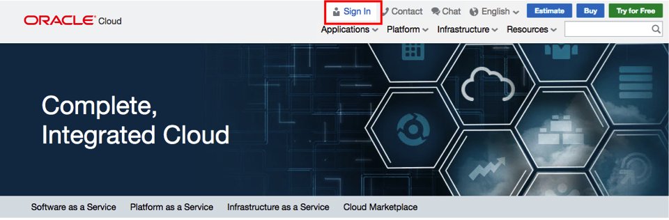
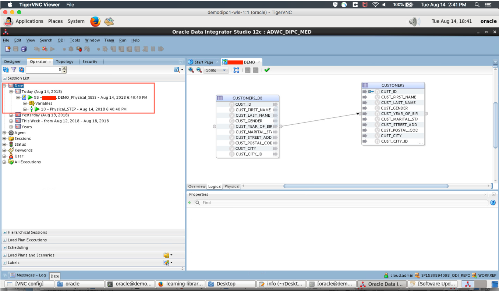
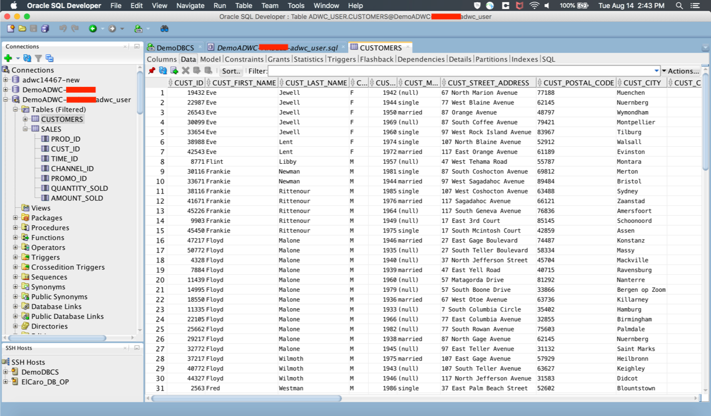

* Provision an Oracle Database Cloud Service (DBCS) instance
* Connect to the DBCS instance using SQL Developer and import relational data as a table
* Create empty table in ADWC with same structure as that in DBCS
* Provision an Oracle Data Integration Platform Cloud (DIPC) instance
* Configure DIPC to support ADWC as the target and the DBCS as the source
* Use Oracle Data Integrator Studio (ODI Studio) which is part of DIPC to load data from DBCS to ADWC
* Verify if the data is loaded in ADWC


# Lab 100: Module 1 - Integrate relational data into ADWC

## Source: Oracle Database Cloud Service (DBCS) - *CUSTOMERS_DB* table
### Step 1: Provisioning a DBCS instance
1. Sign in to Oracle Cloud
    1. Go to [cloud.oracle.com](https://cloud.oracle.com), click **Sign In** to sign in with your Oracle Cloud account.
    <br/>
    
    <br/>
    2. Enter your **Cloud Account Name** and click **My Services**.
    <br/>
    
    <br/>
    3. Enter your Cloud **username** and **password**, and click **Sign In**.
    <br/>
    
    <br/>
2. Provision DBCS
    <br/>
    1. From dashboard, click on **Database**

        
    <br/>
    
    2. Click on **Create Instance**
        
    <br/> 
    3. Provide details for your database instance.
        <ol type="a">
            <li>
            <b>Instance Name</b>: Give any name you would like<br>
            <b>Region</b>: Select <b>No preference</b><br>
            <b>Software Release</b>: Select the latest such as <b>Oracle Database 12c Release 2</b><br>
            <b>Software Edition</b>: Select <b>Enterprise Edition</b><br>
            <b>Database Type</b>: Select <b>Single Instance</b> from the drop-down<br>
            Click on <b>Next</b>
            
            </li><br/>
            <li>
            <b>Database Configuration</b><br>
            <b>DB Name</b>: <b>ORCL</b><br>
            <b>PDB Name</b>: <b>PDB1</b><br>
            <b>Administration Password</b>: Provide a password and confirm again. Remember this password as the DBCS provisioning password.<br>
            Leave defaults for <b>Usable Database Storage (GB)</b> and <b>Total Data File Storage (GB)</b><br>
            <b>Compute Shape</b>: Select the least number of OCPUs and RAM<br>
            <b>SSH Public Key</b>: Click on <b>Edit</b>. Uplaod an existing public key or click on <b>Create a New Key</b>
            
            
            </li><br/>
            <li>
            <b>Backup and Recovery Configuration</b><br>
            <b>Backup Destination</b>: Select <b>None</b> if you do not want to back up your database. Otherwise, select <b>Both Cloud Storage and Local</b> which will create a cloud storage container in your current identity domain of your cloud account.<br>
            <b>Cloud Storage Container</b>: This would be usually prepoulated ending with your database instance name. Store this container URL.<br>
            <b>Username</b>: Enter your cloud account's username such as <i>cloud.admin</i>.<br>
            <b>Password</b>: Enter your cloud account password.<br>
            Check <b>Create Cloud Storage Container</b> if you have not created this container before.<br>
            
            </li>
            <b>Note</b>: DIPC needs a database instance to store its metadata which will be associated at the time of DIPC provisioning. You can use the same database instance as the source database and the DIPC metadata database. If you prefer to use the same, make sure you enable GoldenGate as described in the following. Otherwise, please ignore and click on Next.
            <li>
            <b>Advanced Settings</b><br>
            Check <b>Enable Oracle GoldenGate</b><br>
            Click <b>Next</b>.
            
            </li><br>
            <li>
            Verify all the information and notice that a message saying a cloud container is created with the previously stored URL is displayed at the top.<br>
            Click on <b>Create</b>.<br>
            
            </li>
        </ol>
        


### Step 2: Connect to the DBCS instance using SQL Developer
1. On SQL Developer from the drop down menu, select View and then SSH.
    

2. After Clicking on **New SSH Host**, fill in the form with your DBCS instance's information then, click **OK**.
    <br>
     
    
    <br>
3. After filling out the following form with correct info, click **Test**, once test is successful, click **Connect** to connect to DBCS.
   <br>
    

### Step 3: Load *CUSTOMERS_DB* table from csv
1. Once you are connected to the DBCS, create a user *DB_USER* by running the following script in the SQL Developer.
```
CREATE USER db_user IDENTIFIED BY WelcomeDIPCADWC1;
grant create session, resource, create view, create table to db_user;
ALTER USER db_user DEFAULT TABLESPACE "USERS" TEMPORARY TABLESPACE "TEMP";
ALTER USER db_user QUOTA UNLIMITED ON USERS;
```

2. Download **customers.csv** from _________________include the file link
3. Expand **Other Users** under your database connection and find **DB_USER** (or the db user you just created) and right click on **Tables** and then click **Import Data**
    
    <br>
4. After clicking **Browse** to find the **customers.csv** file, and setting file format accordingly, click **Next**. 
    
    <br>
5. After defining the table name, click **Next**
    
    <br>
6. Choose the columns that you want to include in the table and click **Next**
    
    <br>
7. Click **Next** after reviewing column formats and data types. 
    
    <br>
8. Click finish to start the importing task.
    
    <br>
9. From tables section under **DB_USER** you should be able to see **CUSTOMERS_DB** table listed. Click on the table and check if the data was loaded correctly

    
    

## Target: Oracle ADWC - *CUSTOMERS* table - prerequisite
### Create empty table *CUSTOMERS* in ADWC with same structure as *CUSTOMERS* in DBCS
1. Create a user _ADWC_USER_.
    1. Connect to ADWC instance from SQL Developer as described in ________________include link for Introduction_Start_Here.md
    <br>
    2. Run the following script to create a user _ADWC_USER_ in the ADWC connection in SQL Developer.
    ```
    CREATE USER ADWC_USER IDENTIFIED BY WelcomeDIPCADWC1;
    GRANT CREATE SESSION TO ADWC_USER;
    GRANT DWROLE TO ADWC_USER;
    GRANT SELECT ANY TABLE to ADWC_USER;
    GRANT INSERT ANY TABLE to ADWC_USER;
    GRANT UPDATE ANY TABLE to ADWC_USER;
    ```

2. Connect to ADWC instance as _ADWC_USER_ as described in ________________include link for Introduction_Start_Here.md, except that in username and password of the connection details, provide those of the user you just created (_ADWC_USER_ in this case).
<br>

3. Create empty table **CUSTOMERS** in ADWC
    1. Run
    ```
    begin
    `execute immediate 'DROP TABLE customers';
    exception when others then null;
    end;
    /

    CREATE TABLE customers (
    cust_id                     NUMBER          NOT NULL,
    cust_first_name             VARCHAR2(20)    NOT NULL,
    cust_last_name              VARCHAR2(40)    NOT NULL,
    cust_gender                 CHAR(1)         NOT NULL,
    cust_year_of_birth          NUMBER(4)       NOT NULL,
    cust_marital_status         VARCHAR2(20)    ,
    cust_street_address         VARCHAR2(40)    NOT NULL,
    cust_postal_code            VARCHAR2(10)    NOT NULL,
    cust_city                   VARCHAR2(30)    NOT NULL,
    cust_city_id                NUMBER          NOT NULL,
    cust_state_province         VARCHAR2(40)    NOT NULL,
    cust_state_province_id      NUMBER          NOT NULL,
    country_id                  NUMBER          NOT NULL,
    cust_main_phone_number      VARCHAR2(25)    NOT NULL,
    cust_income_level           VARCHAR2(30)    ,
    cust_credit_limit           NUMBER          ,
    cust_email                  VARCHAR2(50)    ,
    cust_total                  VARCHAR2(14)    NOT NULL,
    cust_total_id               NUMBER          NOT NULL,
    cust_src_id                 NUMBER          ,
    cust_eff_from               DATE            ,
    cust_eff_to                 DATE            ,
    cust_valid                  VARCHAR2(1)     );


    ALTER TABLE customers
    ADD CONSTRAINT customers_pk
    PRIMARY KEY (cust_id);
    ```
    <br>
4. Verify if the table is created. Expand **Tables** and see if the **CUSTOMERS** table is created, if not, right click on **Tables** and select **Refresh**. You should see **CUSTOMERS** table with no data.

    


## Integration: Oracle Data Integration Platform Cloud (DIPC)
### Step 1: Provision a new DIPC instance
1. Sign in to Oracle Cloud
    1. Go to [cloud.oracle.com](https://cloud.oracle.com), click **Sign In** to sign in with your Oracle Cloud account.

    

    2. Enter your **Cloud Account Name** and click **My Services**.

    

    3. Enter your Cloud **username** and **password**, and click **Sign In**.

    

2. Provision


### Step 2: Configure DIPC to support ADWC as the target and DBCS as the source
1. Connect to DIPC instance
    -	Open Terminal
    -	To keep the ssh connection live for long time and not get broken,
        ```
        $ cd /etc/ssh
        $ sudo vi ssh_config
        ```
        - Add `ServerAliveInterval 10`
	    - Press Esc and ZZ to save the file
    - To start ssh connection, go to the folder where you have the public private keys.
        ```
        $ chmod 600 privateKey
        $ ssh –i <privatekey pem format, eg: rsa-key-MEAN> opc@<DIPC IP address, eg: 129.157.248.243>
        $ sudo su - oracle
        $ mkdir /tmp/dipcadw
        ```
    
2. Copy the ADWC wallet to your DIPC server
    1.	Exit out of DIPC SSH connection.
    2.	In local machine: `$ scp -i <privateKey> <ADWC Wallet Zip file> opc@<DIPC IP Address>:/tmp` (replace <> with your instance's values)
    3.	SSH into the DIPC using the above command: `$ ssh –i <privatekey pem format, eg: rsa-key-MEAN> opc@<DIPC IP address, eg: 129.157.248.243>`
    4.	`[opc] $ cd /tmp`
    5.	`[opc] $ ls –al`
    6.	`[opc] $ sudo –s`
    7.	`[root] # chown oracle:oracle <ADWC Wallet Zip file>`
    8.	`[root] # ls –al`
    9.	`[root] # mv <ADWC Wallet Zip file> /tmp/dipcadw/`
    10.	`[root] # exit`
    11.	`[opc] $ sudo su – oracle`
    12.	`[oracle] $ cd /tmp/dipcadw`
    13.	`[oracle] $ ls –al` (you should see your adwc wallet zip file here in /tmp/dipcadw)
    14. `$ unzip /tmp/dipcadw/<ADWC Wallet Zip file> -d /tmp/dipcadw`

3. Configure DIPC TNSNAMES.ORA and SQLNET.ORA
    1. To create the TNSNAMES.ora entries and SQLNET.ora files, connect to your DIPC server via ssh as user opc and run these commands.
    ```
    $ sudo -s
    $ su - oracle
    $ cd /u01/app/oracle/suite/oci/network/admin
    ```
    2. Edit the tnsnames.ora file and add entries for your CDB, PDB (your DBCS instance), and ADWC.  Copy the value for low, medium, and high services from /tmp/dipcadw/tnsnames.ora into /u01/app/oracle/suite/oci/network/admin/tnsnames.ora.  

    3. Create an entry for your CDB by copying the existing DIPC entry 'target' and modify the name and service_name to the CDB.  It should look similar to this but have your specific information. Save the tnsnames.ora file.

    **Note**: The connection alias names `dipc_high`, `dipc_low` and `dipc_medium` below will be different, depending on the name of your ADWC instance. Use the same information what you find in /tmp/dipcadw/tnsnames.ora file.
    ```
    target =
        (DESCRIPTION =
            (ADDRESS_LIST =
                (ADDRESS = (PROTOCOL = TCP)(HOST = DIPCADWDB)(PORT = 1521))
        )
        (CONNECT_DATA =
        (SERVICE_NAME = PDB1.590590425.oraclecloud.internal)
        )
    )

    PDB1 =
        (DESCRIPTION =
            (ADDRESS_LIST =
                (ADDRESS = (PROTOCOL = TCP)(HOST = DIPCADWDB)(PORT = 1521))
        )
        (CONNECT_DATA =
        (SERVICE_NAME = PDB1.590590425.oraclecloud.internal)
        )
    )

    CDB =
        (DESCRIPTION =
            (ADDRESS_LIST =
                (ADDRESS = (PROTOCOL = TCP)(HOST = DIPCADWDB)(PORT = 1521))
        )
        (CONNECT_DATA =
        (SERVICE_NAME = ORCL.590590425.oraclecloud.internal)
        )
    )

    dipc_high = (description= (address=(protocol=tcps)(port=1522)(host=adwc.uscom-east-1.oraclecloud.com))(connect_data=(service_name=xxxxxxx_dipc_high.adwc.oraclecloud.com))(security=(ssl_server_cert_dn=
            "CN=adwc.uscom-east-1.oraclecloud.com,OU=Oracle BMCS US,O=Oracle Corporation,L=Redwood City,ST=California,C=US"))   )

    dipc_low = (description= (address=(protocol=tcps)(port=1522)(host=adwc.uscom-east-1.oraclecloud.com))(connect_data=(service_name=xxxxxxxx_dipc_low.adwc.oraclecloud.com))(security=(ssl_server_cert_dn=
            "CN=adwc.uscom-east-1.oraclecloud.com,OU=Oracle BMCS US,O=Oracle Corporation,L=Redwood City,ST=California,C=US"))   )

    dipc_medium = (description= (address=(protocol=tcps)(port=1522)(host=adwc.uscom-east-1.oraclecloud.com))(connect_data=(service_name=xxxxxxx_dipc_medium.adwc.oraclecloud.com))(security=(ssl_server_cert_dn=
            "CN=adwc.uscom-east-1.oraclecloud.com,OU=Oracle BMCS US,O=Oracle Corporation,L=Redwood City,ST=California,C=US"))   )
            
    ```

    4. Create a sqlnet.ora file in /u01/app/oracle/suite/oci/network/admin/ and add these lines.  Save the file.

    ```
    WALLET_LOCATION = (SOURCE = (METHOD = file) (METHOD_DATA = (DIRECTORY="/tmp/dipcadw")))
    SSL_SERVER_DN_MATCH=yes
    ```
    5. Test your sqlnet connections to the CDB and ADWC.

    **Note**: In the last `sqlplus` command, use the connection alias name found in /tmp/dipcadw/tnsnames.ora file which is copied to /u01/app/oracle/suite/oci/network/admin/tnsnames.ora file.

    ```
    $ export TNS_ADMIN=/u01/app/oracle/suite/oci/network/admin/
    $ export LD_LIBRARY_PATH=/u01/app/oracle/suite/oci
    $ export ORACLE_HOME=/u01/app/oracle/suite/oci
    $ cd $ORACLE_HOME
    $ ./sqlplus sys@CDB as sysdba
    $ ./sqlplus admin@dipc_low
    ```

4. Configure ODI and EDQ JAVA parameters for ADWC
    - To create the required JAVA paramters for ODI you need to add parameters as below.

        ```
        $ vi /u01/jdk/jre/lib/security/java.security
        ```

    - Line 1-9 should already exist. Add lines 10 and 11 and save the file.

        ```
        security.provider.1=sun.security.provider.Sun
        security.provider.2=sun.security.rsa.SunRsaSign
        security.provider.3=sun.security.ec.SunEC
        security.provider.4=com.sun.net.ssl.internal.ssl.Provider
        security.provider.5=com.sun.crypto.provider.SunJCE
        security.provider.6=sun.security.jgss.SunProvider
        security.provider.7=com.sun.security.sasl.Provider
        security.provider.8=org.jcp.xml.dsig.internal.dom.XMLDSigRI
        security.provider.9=sun.security.smartcardio.SunPCSC
        security.provider.10=sun.security.mscapi.SunMSCAPI
        security.provider.11=oracle.security.pki.OraclePKIProvider
        ```

    - To create the required JAVA paramters for EDQ you need to add parameters as below.  Your DIPC server name will be in the path.

        ```
        $ cd /u01/data/domains/DIPCADW_domain/config/fmwconfig/edq/oedq.local.home
        $ vi jvm.properties
        ```

    - Enter the following into that file and save the file.

        ```
        oracle.net.tns_admin=/u01/app/oracle/suite/oci/network/admin
        oracle.net.ssl_server_dn_match=true
        oracle.net.ssl_version=1.2
        oracle.net.wallet_location=(SOURCE=(METHOD=file)(METHOD_DATA=(DIRECTORY=/tmp/dipcadw)))
        ```
5. Restart the DIPC Service
    -  Use the cloud console to stop and start the DIPC service for the JAVA settings to take effect.
    

    - Check the DIPC agent to ensure it is running.  Open the DIPC Console and check the status of the agent.
    

        

    - If the agent is not running you can try to start it manually.

        ```
        $ sudo su - oracle
        $ cd /u01/data/domains/jlsData/dipcagent001/bin
        $ ./startAgentInstance.sh &
        ```


### Step 3: Use Oracle Data Integrator Studio (ODI Studio) which is part of DIPC to load data from DBCS to ADWC
1. Configure and connect the VNC server on your DIPC server

    - Connect to DIPC instance
        - Open Terminal and go to the folder where you have the public private keys.
        - `$ ssh –i <privatekey pen format, eg: rsa-key-MEAN> opc@<DIPC IP address, eg: 129.157.248.243>`
	    - `[opc]$ sudo su – oracle`
        - `[oracle]$ vncserver` (this will start a vncserver, make sure you start as `oracle` user)
        - Provide a password for your vncserver
    - Create a Tunnel for your DIPC vncserver
        - Open new terminal tab or window and go to the folder where you have the public private keys.
        - `ssh -N -L <local port, eg: 5901>:127.0.0.1:<remote port, eg: 5901> -i <private key pen format, eg: rsa-key-MEAN> opc@<DIPC IP address, eg: 129.157.177.226>`
        - Open Tiger VNC Viewer or Real VNCViewer and type `localhost:5901` in the field **VNC Server**. Click on **Connect**.
            
        - Give password you provided when you started the vncserver in the previous step. If successfully logged in, you are in DIPC instance running on Oracle Linux.
2. Open ODI Studio. Click on **Applications**-> **System Tools**-> **Terminal**. To start ODI run this command in a terminal window. Click 'No' for importing preferences.
        `/u01/app/oracle/suite/odi_studio/odi/studio/odi.sh`
3. On the main page, click on **Connect to Repository** and modify the connection information.
    ```
    For ODI Connection enter your cloud user id and password.
    For Database Password enter the admin password used when you provisioned DIPC.  The connection information should already be populated but if you need to find the repository username you can use your dipc pdb sqldev connection to find the username (SPXXXX_ODI_REPO).  The password is the same password you entered when you provisioned DIPC.
    Select the work repository WORKREP.
    Connect to the repository.
    ```
    

4. Create a New Data Server for ADWC (target)
    - Navigate to the Topology tab in ODI, find the Oracle technology, right click, create a 'New Data Server'
    ```
    Name: ADWC_DIPC_MED
    Connection
    Name: ADWC_USER
    Password: WelcomeDIPCADWC1
    ```
    - Click on the JDBC tab of the Data Server to copy and paste the medium connection string from the tnsnames file to the jdbc url and remove any carriage returns and add the following properties by clicking on the green plus sign 3 times
    ```
    oracle.net.ssl_server_dn_match = True
    oracle.net.ssl_version = 1.2
    oracle.net.wallet_location = (SOURCE = (METHOD = file) (METHOD_DATA = (DIRECTORY=/tmp/dipcadw)))
    ```
    
    - Click 'Test Connection' and test both the local and OracleDIAgent agents for success and Ok.
5. Create a Physical Schema for ADWC (target)
    - Right click on the ADWC_DIPC_MED data server and add a new physical schema
    ```
    Schema: ADWC_USER
    Work Schema: ADWC_USER
    ```
    - Click on the Context tab of the physical schema and add a Global Context
    ```
    Logical Schema: ADWC_ODI
    ```
    - Click the save icon to save the physical schema
6. Create a Model for ADWC (target)
    - Click on the 'Designer' tab and expand the 'Models' ribbon then click on the folder to select 'New Model'
    - Enter the following details
        ```
        Name: ADWC_USER
        Technology: Oracle
        Logical Schema: ADWC_ODI
        ```
    - Click Reverse Engineer to import the tables in the schema and you will now see the ADWC tables in the Models ribbon.

        

7. Create a Data Server for DBCS (source)
    - Navigate to the Topology tab in ODI, find the Oracle technology, right click, create a 'New Data Server'
        ```
        Name: DBCS_SRC
        Connection
        Name: DB_USER
        Password: WelcomeDIPCADWC1
        ```
8. Create a Physical Schema for DBCS (source)
    - Right click on the DBCS_SRC data server and add a new physical schema
        ```
        Schema: DB_USER
        Work Schema: DB_USER
        ```
    - Click on the Context tab of the physical schema and add a Global Context
        ```
        Logical Schema: DBCS_LS
        ```
    - Click the save icon to save the physical schema
9. Create a Model for DBCS (source)
    - Click on the 'Designer' tab and expand the 'Models' ribbon then click on the folder to select 'New Model'
    - Enter the following details
    ```
    Name: DB_USER
    Technology: Oracle
    Logical Schema: DBCS_LS
    ```
    - Click Reverse Engineer to import the tables in the schema and you will now see the ADWC tables in the Models ribbon.
10. Create a Mapping
    - Create new project.
    
    - Give a name for your project and save.
    
    - Create a New Mapping
    
    
    - Drag and Drop src and trg Tables in the logical view of the mapping.
    - Open Physical tab, if asked to lock the object, select Yes.
    
    - Run the mapping.
    
    - Open Operator and you should see the status of your mapping. A green triangle represents that the loading is still ongoing. Once it is finished, you should see a green tick mark.
    


## Target: Oracle ADWC - *CUSTOMERS* table - verify
### Verify if the table *CUSTOMERS* in ADWC is populated

- Check if the **CUSTOMERS** table is populated with data from **CUSTOMERS_DB** table of the source DBCS instance.
    


- You have just finished loading data from DBCS to ADWC.