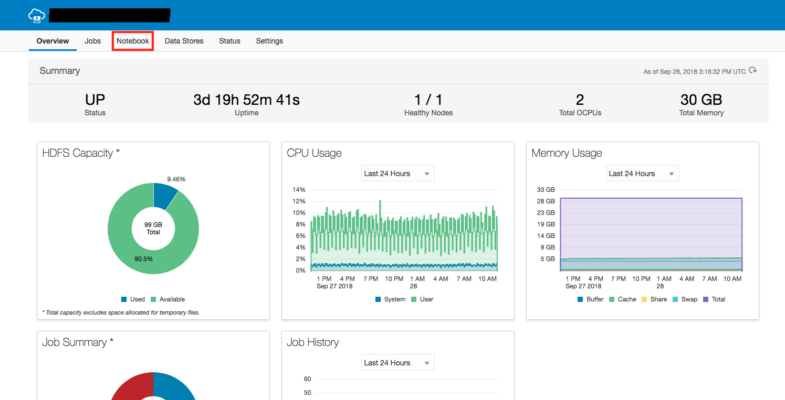
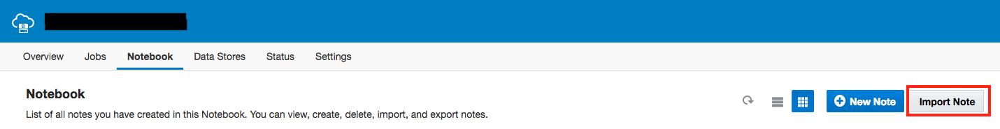
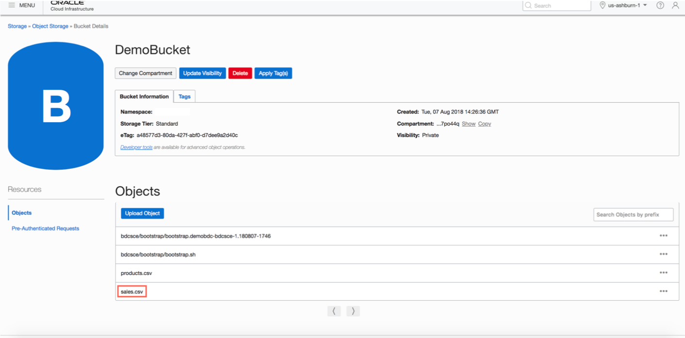
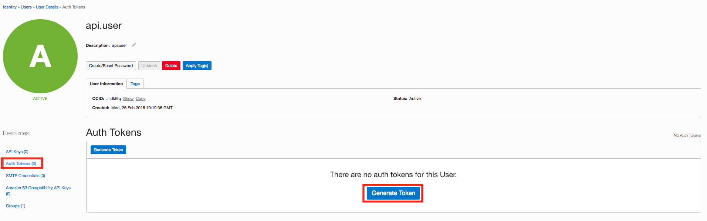

* Provision an Oracle Big Data Cloud (BDC) instance
* Upload data into HDFS of the BDC cluster node
* Create an Object Storage bucket in Oracle Cloud Infrastructure (OCI)
* Process and store the data from BDC HDFS to OCI Object Storage bucket
* Create an empty table in ADWC
* Load processed big data file from OCI Object Storage to Oracle ADWC
* Verify if the data is loaded in ADWC


# Lab 200: Module 2 - Integrate big data into ADWC

## Target: Oracle ADWC - *CUSTOMERS* table - prerequisite
### Step 1: Create empty table **SALES**
- Create an empty table called **SALES** in ADWC which is the target.
    ```
    begin
    execute immediate 'DROP TABLE sales';
    exception when others then null;
    end;
    /

    CREATE TABLE sales (
    prod_id             NUMBER          NOT NULL,
    cust_id             NUMBER          NOT NULL,
    time_id             DATE            NOT NULL,
    channel_id          NUMBER(6)       NOT NULL,
    promo_id            NUMBER          NOT NULL,
    quantity_sold       NUMBER(10,2)    NOT NULL,
    amount_sold         FLOAT    NOT NULL);
    ```


## Source: Oracle Big Data Cloud (BDC) + OCI Object Storage
### Step 1: Provisioning BDC
https://millerhoo.github.io/journey2-new-data-lake/workshops/journey2-new-data-lake/?page=LabGuide100StartHere.md
### Step 2: Upload file **sales.csv** to BDC
- Download **sales.csv** from _________________include link for download
- Open a terminal and copy this file to BDC instance using `scp`.
    `$ scp -i <privateKey> <path to sales.csv> opc@<BDC IP Address>:/tmp`
### Step 3: Process data in BDC and push to OCI Object Storage
- Download the Notebook from ________________give the link.
- 
1. From the Big Data Cloud console, click on the hamburger menu of the instance you created and click **Big Data Cloud Console**
  
  <br>
2. Click on the Notebook tab to import the zeppelin notebook.
  
  <br>
3. Click **Import Note** and then **Browse** import the notebook file downloaded previously.  
  
  
  <br>
 4. Review the content of the notebook, and run the notebook to create hive table and load data in hdfs to an object storage . 
  

### Step 4: Verify file in OCI Object Storage


### Step 5: Generate an AuthToken
AuthToken is required for an ADWC instance to access data files on Object Storage. 
1. From the OCI Console, Click **Identity** > **Users**. 
  
  <br>
2. After selecting a user, click Auth Tokens and then **Generate Token**. Fill in the description and click **Generate Token**. A random token will be generated. <u>*Make sure to copy and save the value that is generated.*</u>
  
  

## Target: Oracle ADWC - *SALES* table - process and verify
### Step 1: Create Credential Store
- Open SQL Developer connection of your ADWC instance.
- In `create_credential` function, please make sure you copy the `username` as the username of the user you created or generated AuthToken for and the `password` as the AuthToken you stored before for this user.
```
--- Create a Object Storage Credential Store
BEGIN
  dbms_cloud.drop_credential(credential_name => 'OBJ_STORE_CRED');
  exception when others then null;
END;
/

set define off
begin
  DBMS_CLOUD.create_credential(
    credential_name => 'OBJ_STORE_CRED',
    username => 'api.user',
    password => 'ONnKn-1f_x{x1RmVRAR3'
  );
end;
/
set define on
```
### Step 2: Run Scripts to load

-------TODO: How to find swiftobjectstorage link
```
define base_URL='https://swiftobjectstorage.us-ashburn-1.oraclecloud.com/v1/<identitydomain>/<BucketName>'

define sales_URL = '&base_URL/sales.csv';

begin
 dbms_cloud.copy_data(
    table_name =>'SALES',
    credential_name =>'OBJ_STORE_CRED',
    file_uri_list => '&sales_URL',
    format => json_object('ignoremissingcolumns' value 'true', 'skipheaders' value '1', 'delimiter' value ',', 'removequotes' value 'true', 'blankasnull' value 'true')
 );
end;
/
```
### Step 3: Verify **SALES** table is populated


