# ADWC DEMO
Aug 22, 2018

Author: Sravya Ganugapati
## Index
1. [Introduction](#introduction)
1. [Oracle Cloud Services Used](#oracle-cloud-services-used)
2. [Usecases Overview](#usecases-overview)
1. [Oracle Cloud Services Overview](#oracle-cloud-services-overview )
    1. [Oracle Autonomous Data Warehouse Cloud Service](#oracle-autonomous-data-warehouse-cloud-service)
    1. [Oracle Database Cloud Service](#oracle-database-cloud-service)
    1. [Oracle Data Integration Platform Cloud](#oracle-data-integration-platform-cloud)
    1. [Oracle Big Data Cloud](#oracle-big-data-cloud)
    1. [Oracle Cloud Infrastructure Object Storage](#oracle-cloud-infrastructure-object-storage)
    1. [Oracle Data Visualization Desktop](#oracle-data-visualization-desktop)
3. [Usecase 1: Relational data](#usecase-1---relational-data-to-oracle-autonomous-data-warehouse-cloud-using-oracle-data-integration-platform-cloud)
4. [Usecase 2: Big data](#usecase-2---big-data-to-oracle-autonomous-data-warehouse-cloud-using-oracle-data-lake)
5. [Usecase 3: External Table](#usecase-3---external-table)
6. [Usecase 4: Visualization using Oracle Data Visualization Desktop](#usecase-4---visualization-using-oracle-data-visualization-desktop)
7. [Conclusion](#conclusion)

## Introduction
This demo will walk you through the different usecases that achieve data integration of different data sources, especially big data and relational data in one place - Oracle Autonomous Data Warehouse Cloud - using Oracle cloud products and services. To try Oracle Cloud services, please visit [Oracle Cloud](http://cloud.oracle.com) and sign up for a free trial account worth $300. 

Oracle Autonomous Data Warehouse Cloud provides an easy-to-use, fully autonomous database that scales elastically, delivers fast query performance and requires no database administration.
* **Scalable**: so you can scale down the environments when the resources are not needed, significantly reducing costs or even totally disable the CPU when not in use and just keep the storage up and running.
* **Fast**: delivers high performance data warehousing straight out-of-the-box with unparalleled scalability and reliability. Built on key Oracle Database capabilities: parallelism, columnar processing and compression. All aspects of performance tuning are automatically managed so the service requires no database tuning.
* **Self-driving**: virtually eliminates the need for the manual operational tasks such as backup and patching 
which provides consistently better performing and more secure environments.
* **Automation**: opens opportunities for DBAs to elevate their roles from custodians of databases into more valued data professionals who can deliver more  applications, focus more on the needs of application developers, and extract more value from their current data assets.

## Oracle Cloud Services Used
* [Oracle Autonomous Data Warehouse Cloud Service](https://cloud.oracle.com/en_US/datawarehouse)
* [Oracle Database Cloud Service](https://cloud.oracle.com/database)
* [Oracle Data Integration Platform Cloud](https://cloud.oracle.com/en_US/data-integration-platform)
* [Oracle Big Data Cloud](https://cloud.oracle.com/bigdata)
* [Oracle Cloud Infrastructure Object Storage](https://cloud.oracle.com/storage/object-storage/features)
* [Oracle Data Visualization Desktop](https://cloud.oracle.com/en_US/oac)

## Usecases Overview
The goal of these usecases is to consolidate different kinds of data - relational and big data, in this demo - in one place such as [Oracle Autonomous Data Warehouse Cloud](https://cloud.oracle.com/en_US/datawarehouse). Here is the overall architecture of this demo. Don't be overwhelmed, we will explain more in detail in the coming sections.

Once we have the relational data and the big data in Oracle Autonomous Data Warehouse, we can connect it to Oracle Data Visualization Desktop for preparing reports and visualizations or we can perform data mining and machine learning in the Zeppelin notebooks that come out-of-the-box with Oracle Autonomous Data Warehouse Cloud service. The reports are shareable across the organization and a Data Analyst can run analysis similar to how he or she does on a regular database.

1. Usecase #1: Relational data to Oracle Autonomous Data Warehouse Cloud using Oracle Data Integration Platform Cloud

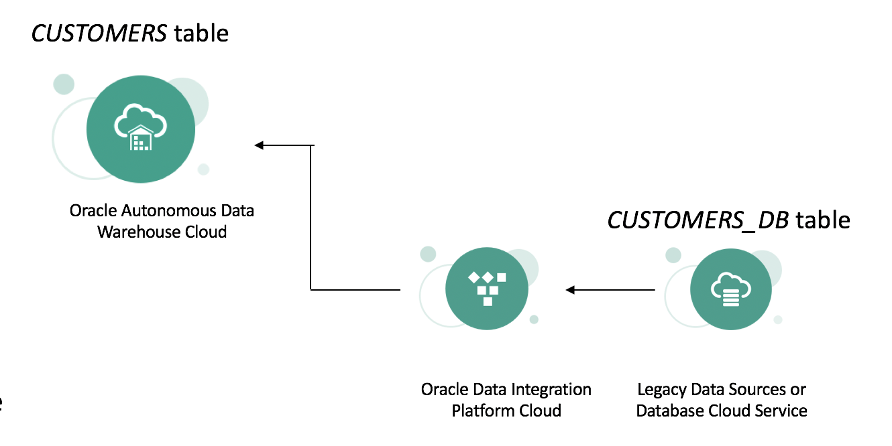
    This usecase explains how we can achieve loading data from a relational database, that could represent on-premise legacy data sources for an organization, into an Oracle Autonomous Data Warehouse Cloud instance. This is implemented using Oracle Data Integrator that is part of Oracle Data Integration Platform Cloud.

2. Usecase #2: Big data to Oracle Autonomous Data Warehouse Cloud using Oracle Data Lake (Oracle Big Data Cloud + Oracle Cloud Infrastructure Object Storage)

    This usecase shows how we can leverage Oracle Data Lake to run Big Data workloads and push it to Oracle Autonomous Data Warehouse Cloud after data processing.

3. Usecase #3: External Table

    In this usecase, we create an external table in Oracle Autonomous Data Warehouse Cloud from Oracle Cloud Infrastructure Object Storage. The data is not brought into Oracle Autonomous Data Warehouse Cloud, but resides in Oracle Cloud Infrastructure Object Storage and on which we can run queries efficiently.

4. Usecase #4: Visualization using Oracle Data Visualization Desktop
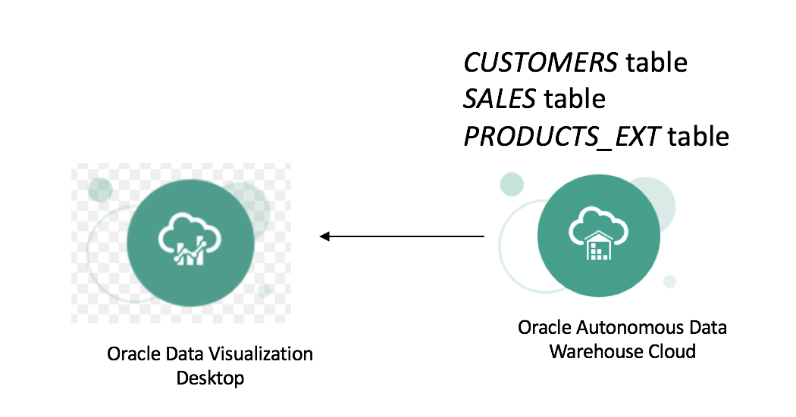
    In this last usecase, we show how we can connect Oracle Data Visualization Desktop and Oracle Autonomous Data Warehouse Cloud to make visualizations on the consolidated data and to obtain better data inisghts.

## Oracle Cloud Services Overview

In this section, we go through the features and the provisioning details of the Oracle Cloud services used through out this demo.

1. ### Oracle Autonomous Data Warehouse Cloud Service
    #### Provisioning
    * The Oracle Autonomous Data Warehouse is provisioned in a very easy and a quick way - you just need a couple of details such as how much storage and CPU you need and an admin password. The provisioning takes around 30 seconds to 1 minute and you are ready to use your instance!

    * Here are the steps to follow for provisioning an Oracle Autonomous Data Warehouse Cloud Service instance.

        1. Click on Autonomous Data Warehouse Cloud from the OCI Cloud Console.

            

        1. Click on Create Autonomous Data Warehouse.
            

        1. Provide details for creating Autonomous Data Warehouse Cloud instance.
            

    #### Oracle Autonomous Data Warehouse Cloud Console
    * The Autonomous Data Warehouse Cloud Console provides a dashboard that shows the storage capacity of the warehouse, CPU utilization, running SQL executions etc.
    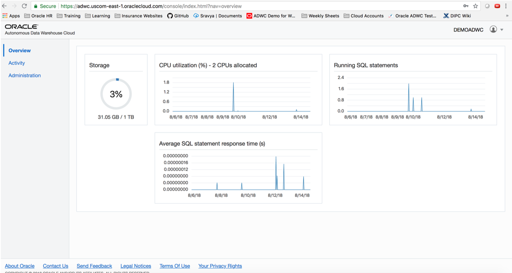

    #### Connecting to Oracle Autonomous Data Warehouse Cloud
    * Autonomous Data Warehouse Cloud service provides a secure way of connecting to it with the help of a Credential Wallet which the connecting client can use.
    * The client can download the wallet from the ADWC instance’s console.
    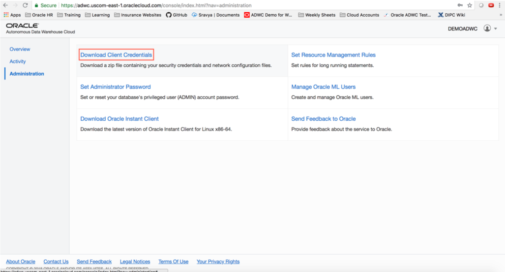
    * Use ADWC provisioning password and the downloaded Credential Wallet zip file to create a connection to the Autonomous Data Warehouse Cloud instance.
    
    
    #### Workshop Link
    * To learn more in detail about how to provision and other information about Oracle Autonomous Data Warehouse Cloud, please visit [Oracle ADWC Workshop](https://oracle.github.io/learning-library/workshops/journey4-adwc/?page=README.md).

1. ### Oracle Database Cloud Service
    #### Features
    * Enterprise-proven database cloud service that supports any size workload from dev/test to large scale production deployment.
    * Multi-layered, in depth security with encryption by default. A highly available and scalable service delivering speed, simplicity and flexibility for faster time to value and savings.
    * **Fast**: Oracle Database in highly available and scalable configurations rapidly provisioned and ready for use in minutes.
    * **Elastic**: Add capacity on-demand and scale OLTP and Data Warehouse workloads as your business grows from startup to the largest enterprise.
    * **Secure**: Security on Oracle Cloud protects the entire lifecycle of data both in transit and at rest. Database access is monitored and recorded for audit and control at all times.
    * **Simple**: Oracle Database with administration fully managed by Oracle or under your control with one-click built in automation. Supports modern agile development with RESTful APIs for quick, automated and repeatable use.
    * **Choice**: Shared, dedicated, virtualized, bare metal and engineered deployment targets to optimize cost in a pay per need model.

    #### Provisioning
    * For provisioning details and a dedicated Oracle DBCS workshop, please visit [Oracle DBCS Workshop](https://oracle.github.io/learning-library/workshops/dbcs/?page=README.md)

1. ### Oracle Data Integration Platform Cloud
    #### Features
    * Oracle Data Integration Platform Cloud with autonomous capabilities helps migrate and extract value from data by bringing together capabilities of a complete Data Integration, Data Quality, and Data Governance solution into a single unified autonomous cloud based platform.
    * Data Integration Platform Cloud incorporates machine learning and artificial intelligence powered features including automated data migration and data warehouse building as well as machine assisted data profiling and governance.
    * **Single Platform**: Integrated, Powerful data driven solution to fulfill your business needs for real-time data replication, data transformation, data quality, and data governance.
    * **Open Platform**: Runs on Oracle Cloud, On-Premises, integrating and accessing 100s of Oracle and Non-Oracle sources and targets to accelerate your data integration needs.
    * **Intuitive Enhanced UX**: Optimized user experience delivers value quickly, simplifying data tasks providing self-service for IT and Business users.
    * **Comprehensive Capabilities**: Provides broad data integration capabilities for replicating mission critical data, profiling, enriching, transforming, cleansing, and matching for all your data needs, including for analytics and business solutions.

    #### Provisioning

    * For provisioning information and a workshop, please visit [Using Oracle Data Integration Platform Cloud (DIPC) with ADWC](https://oracle.github.io/learning-library/workshops/journey4-adwc/?page=LabGuideDIPC.md)

1. ### Oracle Big Data Cloud
    #### Features
    * The power of Hadoop and Spark delivered as a secure, automated, high-performance service, which can be fully integrated with existing enterprise data in Oracle Database and Oracle Applications.
    * **Dedicated**: Dedicated instances, networks and direct attached disk deliver consistent high-performance.
    * **Secure**: Fully secured and encrypted Hadoop clusters, with additional ability to extend Oracle Database security to Hadoop.
    * **Optimized**: Optimized configuration based on the specific compute shapes, enables fast time to value.
    * **Comprehensive**: Includes the fully supported Cloudera Hadoop (including Apache Spark) ecosystem. Additional included Oracle software: Data Integration, R Distribution, Spatial and Graph.

    #### Provisioning
    * Here are the steps to follow to provision an Oracle Big Data Cloud instance.
        1. Click on Create Instance to create a Big Data Cloud service cluster to run Big Data workloads.
        
        1. Provide details for your BDC service.
        
        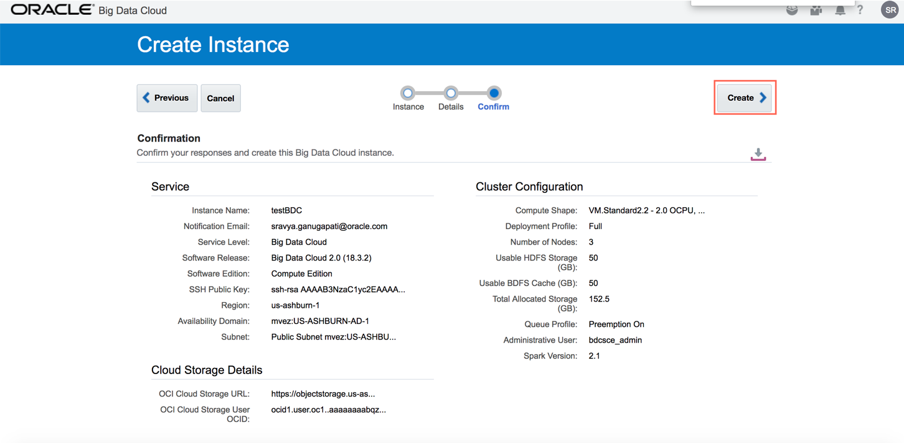

    #### Big Data Cloud Console
    * Access Big Data Cloud Console from the instance overview page.
    * It provides a dashboard that shows the HDFS storage availability and usage, CPU and memory usage, running jobs etc.
    
    * Big Data Cloud comes out-of-the-box with Zeppelin notebooks.
    * Notebooks provide a way to  write code within the same page with the use of different interpreter bindings such as %spark, %pyspark, %sql, %sh, %r, %jdbc, %hbase etc. to run the Big Data workloads.
    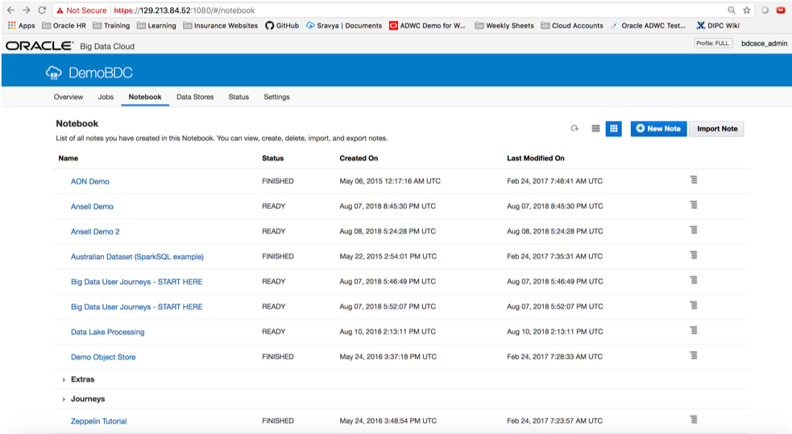

    #### Workshop Link
    * To learn more in detail about how to provision and other information about Oracle Big Data Cloud, please visit [Oracle BDC Workshop](https://oracle.github.io/learning-library/workshops/journey2-new-data-lake/?page=README.md)

1. ### Oracle Cloud Infrastructure Object Storage

    #### Features
    * Oracle Object Storage is a web-based interface that provides the ability to accelerate a broad range of high performance applications with your choice of high IO block storage, and durable, high-throughput object storage.
    * **Highly durable and available**: Automatically replicates objects across multiple fault domains for high durability. Actively monitored for data integrity and availability.
    * **Unlimited Scale**: Store unlimited objects per bucket for large amounts of unstructured data like videos, backups, and logs.
    * **High Throughput**: Low latency, strongly consistent regional service has the throughput to support high speed streaming and Big Data workloads.

    #### Provisioning
    * Data is stored in Object Storage in the form of Buckets.
    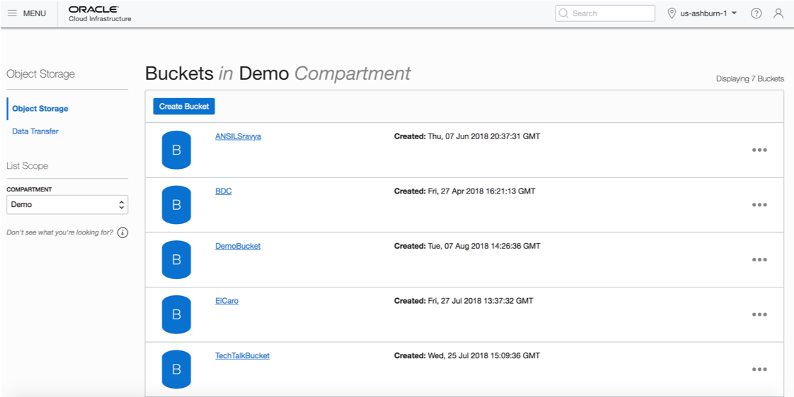
    * We can see that we have _products.csv_ in the _DemoBucket_ which we are going to use for the Usecase#3.
    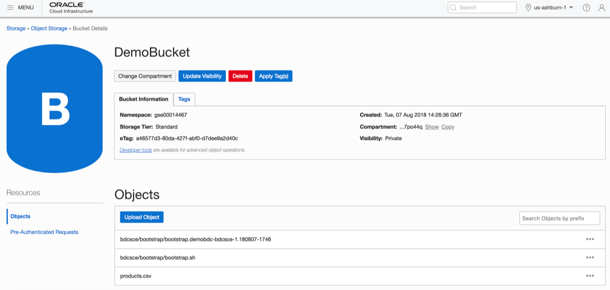

1. ### Oracle Data Visualization Desktop
    * Oracle Data Visualization Desktop makes it easy to visualize your data so you can focus on exploring interesting data patterns.
    * You can connect this to many Oracle Applications or a database such as Oracle Autonomous Data Warehouse Cloud to make insightful visualizations on the data.
    * For more information, please visit [Oracle® Fusion Middleware User’s Guide for Oracle Data Visualization Desktop](https://docs.oracle.com/dvdesktop/latest/desktop/BIDVD/toc.htm).

## Usecase 1 - Relational data to Oracle Autonomous Data Warehouse Cloud using Oracle Data Integration Platform Cloud
* Oracle Database Cloud Service --> Oracle Autonomous Data Warehouse Cloud Service

* In this usecase, we show how we can achieve loading relational data from legacy data sources to Oracle Autonomous Data Warehouse Cloud instance using Oracle Data Integration Platform Cloud (DIPC).
* Oracle Data Integration Platform Cloud is a cloud-based platform for data transformation, integration, replication, analysis, and governance. It offers three editions:
    * **Standard: Oracle Data Integrator**
        * High-performance Extract Transform and Load functions. With this option, you bulk copy your data sources, and then extract, enrich, and transform your data entities using Oracle Data Integrator.
    * **Enterprise: Oracle Data Integrator + Oracle Golden Gate**
        * All elevated integration task execution capabilities, stream analytics, and Big Data technologies on top of Standard Edition.
    * **Governance: Oracle Data Integrator + Oracle Golden Gate + Oracle Enterprise Data Quality**
        * Data quality, data profiling, and data governance features in addition to the functionality included in Enterprise Edition. With this option, you profile, cleanse and govern your data sources with customized dashboards. 
* The source table is *CUSTOMERS_DB* in the source legacy data source system which is Oracle Database Cloud Service in this case.
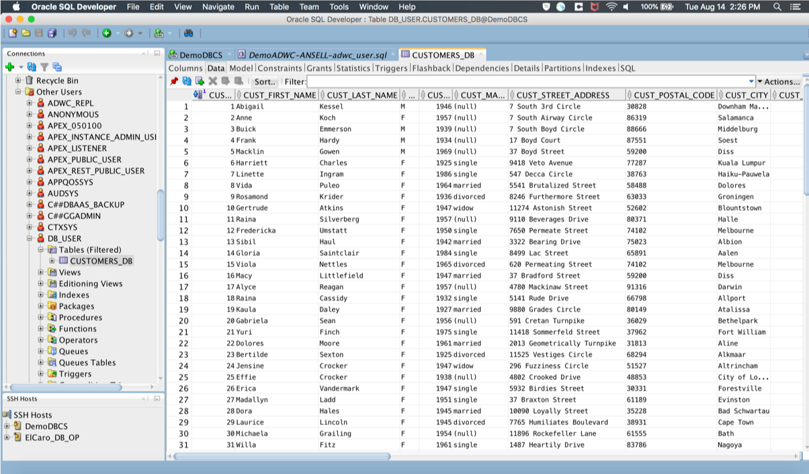

* The target table is *CUSTOMERS* table in Oracle Autonomous Data Warehouse Cloud service which is initially empty.
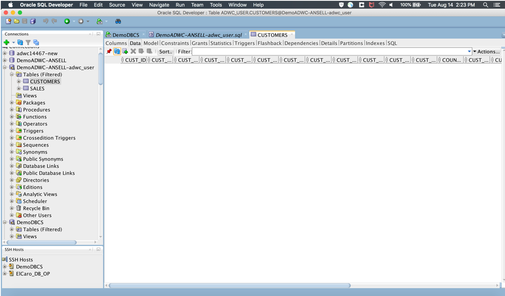

* We use Oracle Data Integrator (ODI) that comes part of the Oracle Data Integration Platform Cloud service. ODI Studio is an ETL tool used to load data between disparate data systems. The source metadata and the target metadata is brought into ODI Studio after configuring the physical and logical architecture of the source and target systems. A mapping is created from this metadata information which when run will load the data from source to target table.
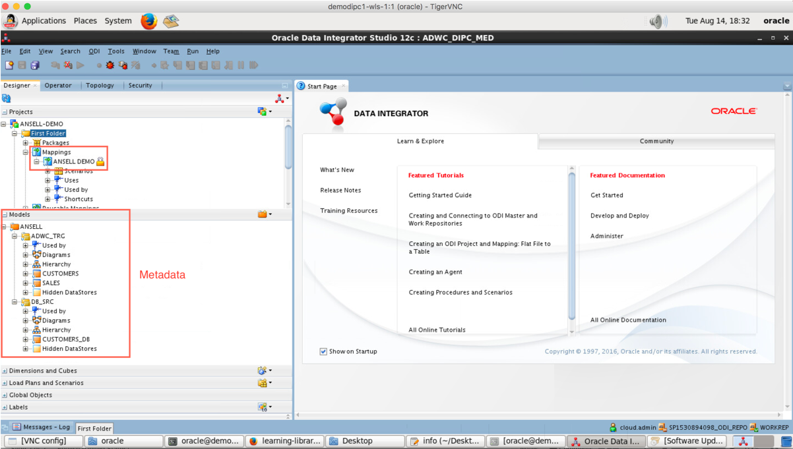
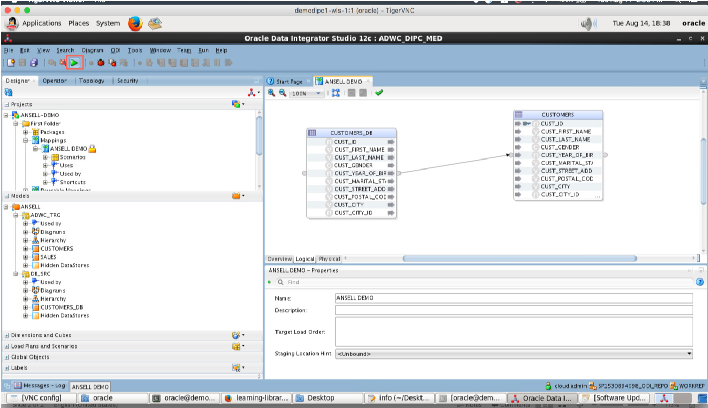

* We can track the status of the load in the Operator tab of the ODI Studio. A green triangle means that the mapping is still running and a green tick indicates that the mapping is finished. You can keep refreshing to know if the status changed.
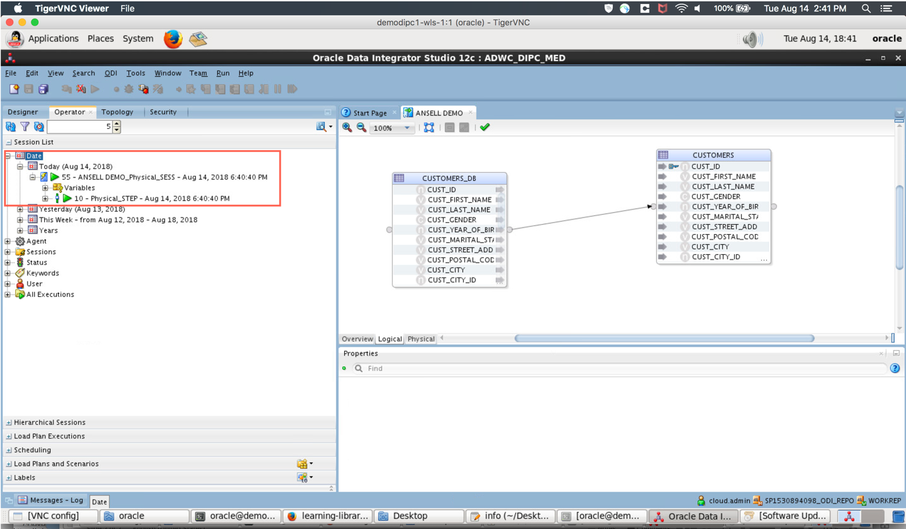

* After the mapping is complete, if we refresh the data in the target table *CUSTOMERS* in Oracle Autonomous Data Warehouse Cloud which was initially empty, we can see that the data is now there as ODI loaded the data from *CUSTOMERS_DB* source table.
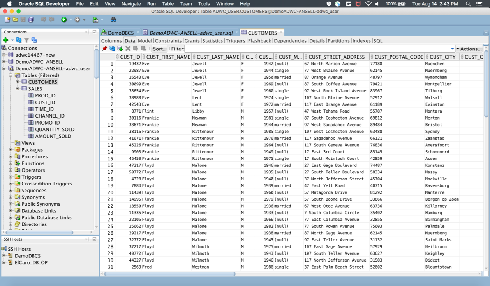

## Usecase 2 - Big data to Oracle Autonomous Data Warehouse Cloud using Oracle Data Lake

* Oracle Data Lake --> Oracle Autonomous Data Warehouse Cloud

* Oracle Data Lake = Oracle Big Data Cloud + Oracle Cloud Infrastructure Object Storage
* This usecase demonstrates how we can process big data workloads in Oracle Big Data Cloud and then push it to Oracle Cloud Infrastructure Object Storage (OCI Object Storage) from where we can load it to Autonomous Data Warehouse Cloud instance.

* We have a source csv file *sales.csv* which is stored in HDFS storage of the BDC cluster instance. Then we follow the below steps to push it to Oracle Autonomous Data Warehouse Cloud finally:
    * Create a Hive table *SALES* from that csv and process it in Oracle Big Data Cloud
    * Store the Hive table *SALES* which is processed as a CSV file *sales.csv* in HDFS of Oracle Big Data Cloud instance.

        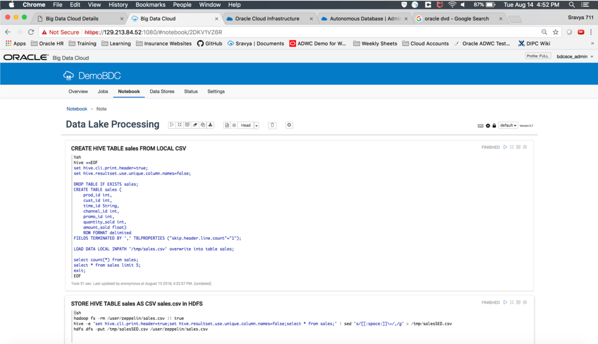

    * Push *sales.csv* from Oracle BDC HDFS to OCI Object Storage.
        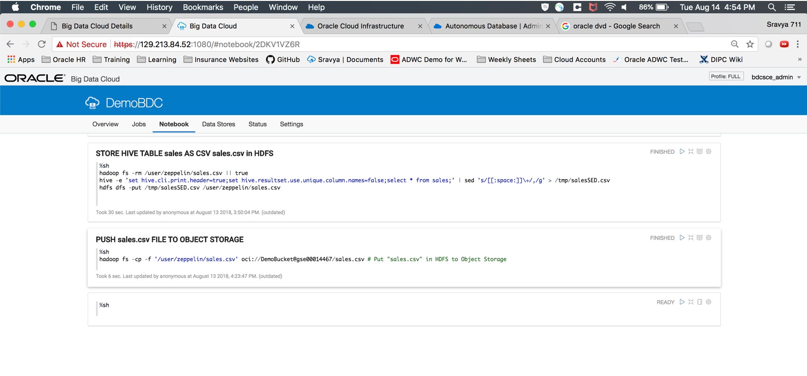
* We can see that the *sales.csv* file is pushed to OCI Object Storage in one of the buckets.
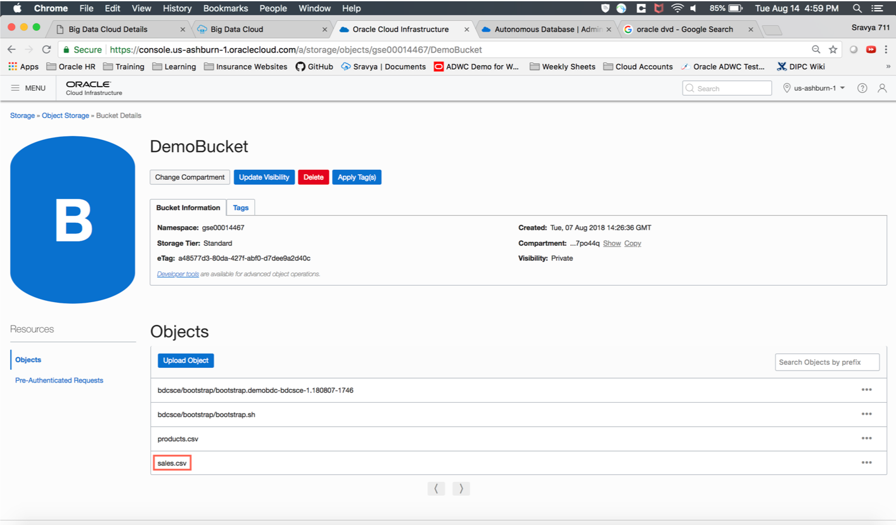

* Now, we have to load this csv file from OCI Object Storage into Oracle Autonomous Data Warehouse Cloud table *SALES* which is initially empty as can be seen from the following figure.
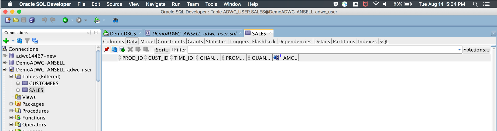

* We use *copy_data()* function of the *DBMS_CLOUD* PL/SQL package that comes out-of-the-box with Oracle Autonomous Data Warehouse Cloud instance to pull data from OCI Object Storage into the target table *SALES*.
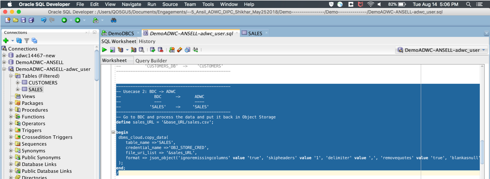

* After we run the PL/SQL code in the SQL Developer connection of the Oracle Autonomous Data Warehouse Cloud, if we refresh the data tab of the *SALES* table and we can see that now, the table is not empty and is loaded with data from *sales.csv* of the OCI Object Storage.
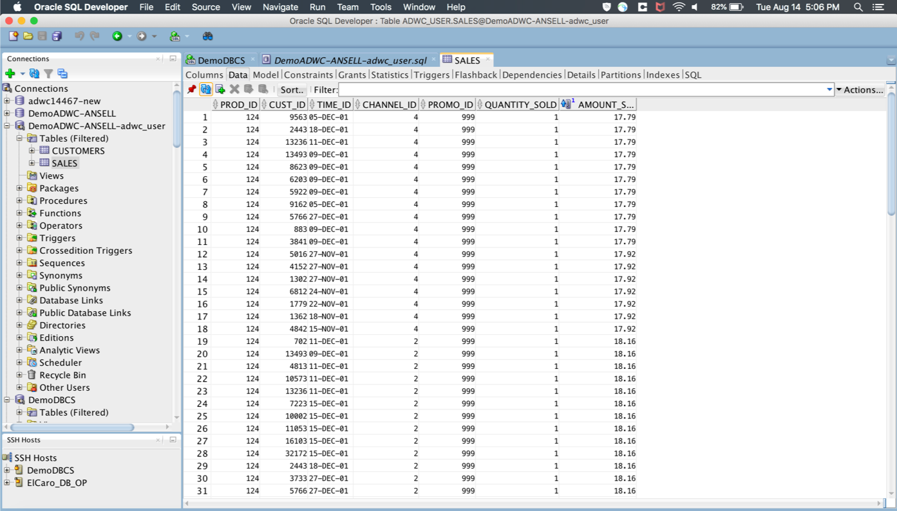

## Usecase 3 - External Table
* Object Storage --> ADWC

* We show how we can create an external table from OCI Object Storage in Oracle Autonomous Data Warehouse Cloud with data still being in the OCI Object Storage but being able to run queries and analysis on this external table in Oracle Autonomous Data Warehouse Cloud.

* The source data is in the file *products.csv* which is stored in OCI Object Storage.
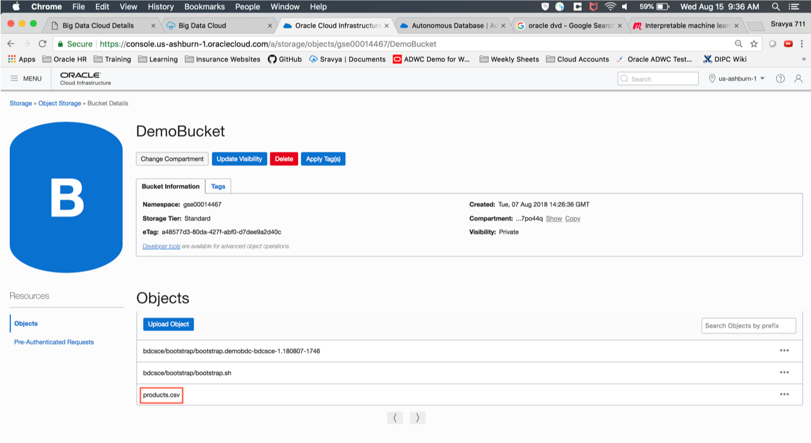

* The target table is *PRODUCTS_EXT* in Oracle Autonomous Data Warehouse Cloud which is not existing initially as we can see from the following figure.

* We use *create_external_table()* function of the *DBMS_CLOUD* PL/SQL package that comes out-of-the-box with Oracle Autonomous Data Warehouse Cloud instance to create an external table from the OCI Object Storage.
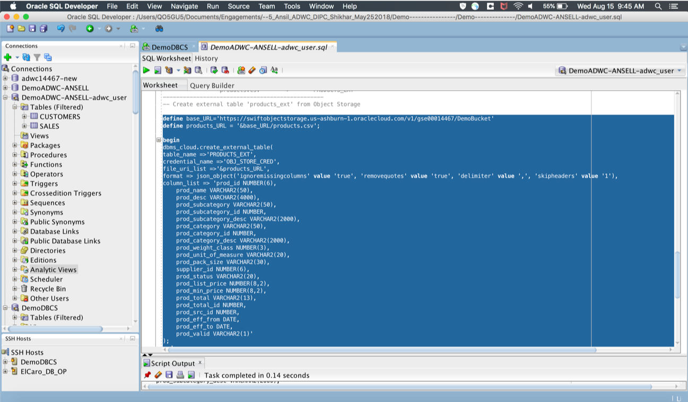

* After we run the PL/SQL code in the SQL Developer connection of the Oracle Autonomous Data Warehouse Cloud, if we refresh the data tab of the *PRODUCTS_EXT* table and we can see that now, the table is populated with data from the file in the OCI Object Storage where the data actually resides.
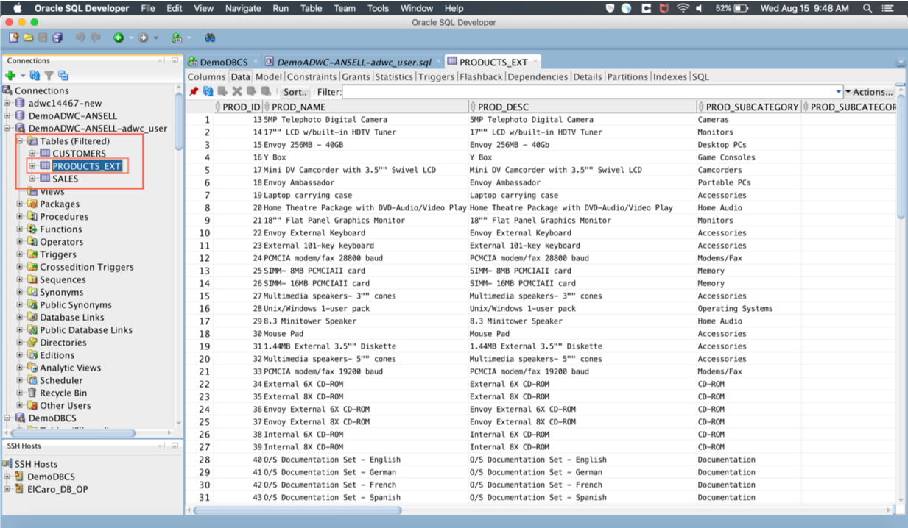

## Usecase 4 - Visualization using Oracle Data Visualization Desktop
* Oracle Autonomous Data Warehouse Cloud --> Oracle Data Visualization Desktop

* We show how we can prepare visualizations and reports on the data present in Oracle Autonomous Data Warehouse Cloud in this usecase.

* Once we have all the data - relational and big data - in one place, we can connect Oracle Data Visualization Desktop to Oracle Autonomous Data Warehouse Cloud to run a consolidated analysis on the three tables *CUSTOMERS*, *SALES*, *PRODUCTS_EXT*.

* Create a consolidated view *REPORT* in Oracle Autonomous Data Warehouse Cloud that has the data which illustartes how much each customer spent in each product category.
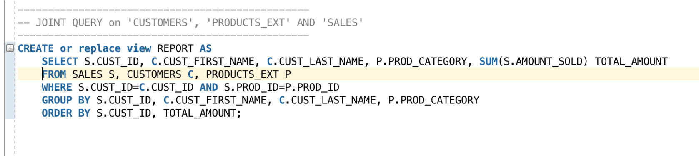
* To connect from Oracle Data Visualization Desktop to Oracle Autonomous Data Warehouse Cloud, click on Create and then click on Connection.
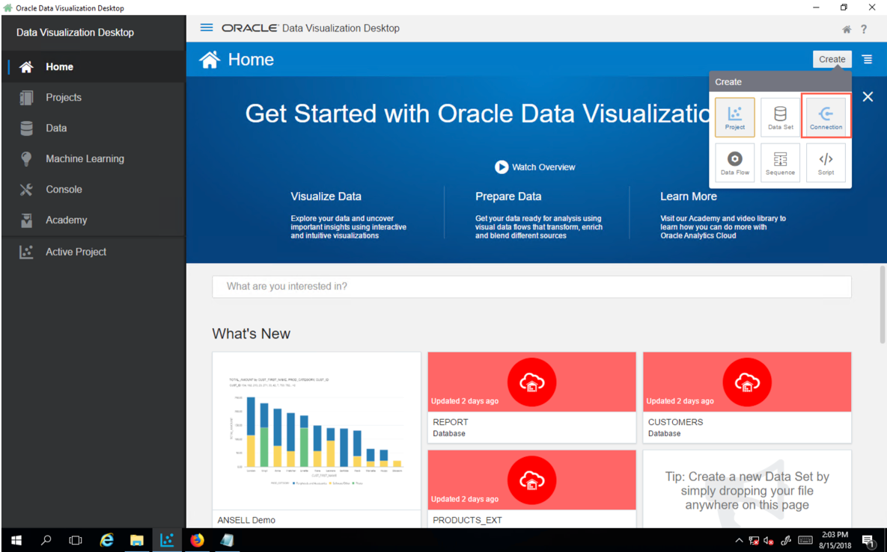
* Select Oracle Autonomous Data Warehouse from the list of connections.
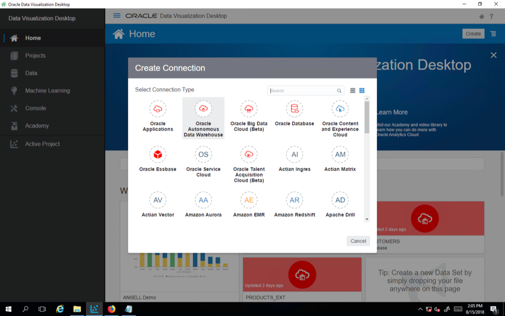
* Provide connection details for the Autonomous Data Warehouse Cloud instance which can be found in the tnsnames.ora file of the Client Credential wallet zip file downloaded from the ADWC console.
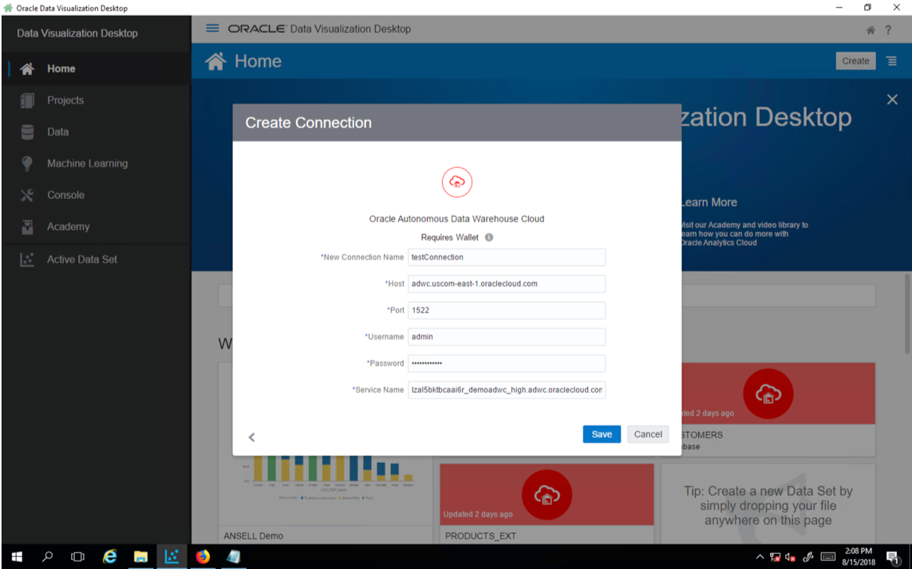
* Once the connection is successful, you can select which table or view you need to visualize on Oracle Data Visualization Desktop. Here we select *REPORT* view created earlier. Drag and drop the fields from the *REPORT* view to create a stacked bar chart that shows how much each customer spent on each product category.
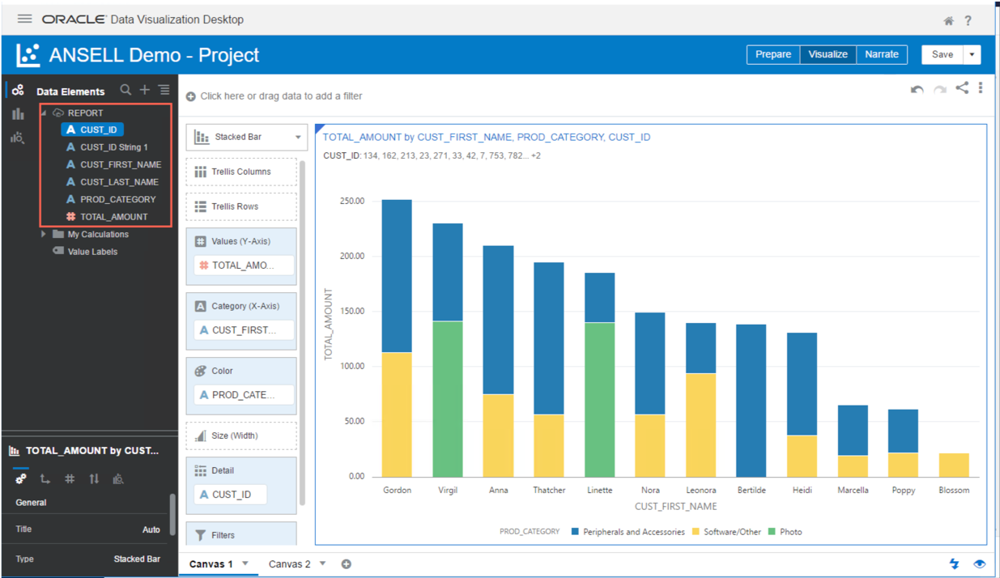

## Conclusion

In this demo, we illustrated how we can achieve data integration between different data sources, especially relational and big data in Oracle Autonomous Data Warehouse Cloud service using Oracle Cloud.
